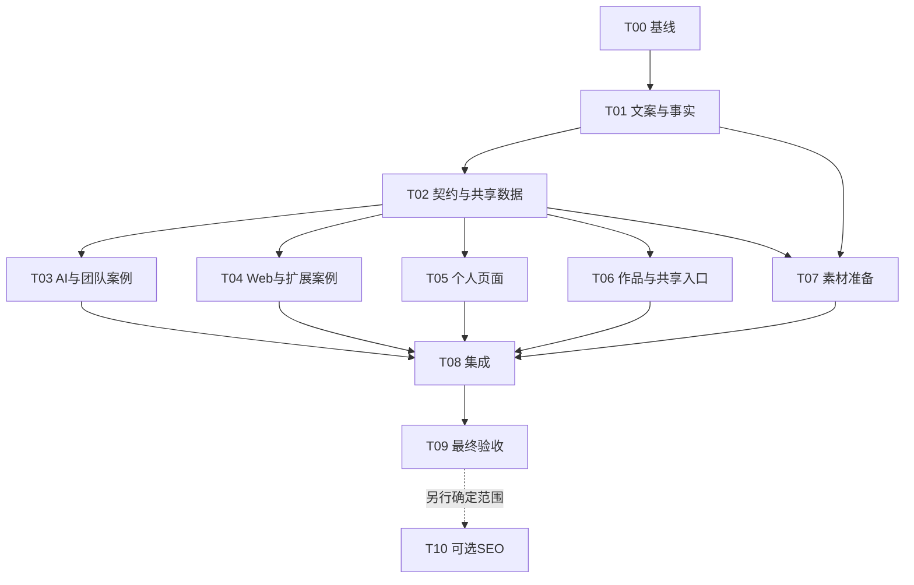

# 个人网站内容升级：详细执行与 Agent 交接计划

版本：v1 · 2026-09-30 · 状态：待执行

依据：[内容升级方案](website-content-update-plan.md)。已确认的要求：**Applied AI + Full-Stack 定位；保留网站现有 UI 风格**。

本文件用于后续分阶段、跨 agent 执行。本次只编写计划，没有启动实施 agent，没有修改运行代码。下文的任务状态、命令结果、截图和交接记录均由实际执行者填写，不能视为已经完成。

## 1. 执行入口与事实来源

项目根目录：`/Users/xieyongjie/Documents/Projects/YongWork/yongwork`。

事实库根目录：`/Users/xieyongjie/Documents/Vault/Resume`。本轮只读；执行前阅读其 `AGENTS.md`、`00-Start Here.md` 和 `WORKSPACE_BASELINE.md`。不修改 Facts、Evidence、Guides 或原始凭据。

每个 agent 开始前读取：

1. 项目最新适用的 AGENTS.md（若后来新增，以执行时版本为准）。
2. 本计划、原内容方案和自己任务引用的事实文件。
3. 任务看板、决策记录、上一阶段交接记录及当前工作区差异。

事实选取顺序：Candidate → Skills → Claim Registry → 相应 Projects；需要核对来源时再读取 Source Records。Design Portfolio 用于设计证据。已有网站文字和 Baseline Resumes 不覆盖 Facts；`.workbuddy/` 不作证据来源。

事实库如果在执行期间更新，以最新明确确认的记录为准，并在来源映射中记录变化。运行中的网站只使用项目内选定的公开数据，不访问私有事实库。

## 2. UI 保留约束与验收依据

### 2.1 必须沿用的风格

| 现有规则 | 执行要求 | 代码依据 |
| --- | --- | --- |
| 深灰背景 `#212121` | 保留全站背景，不引入另一套主题 | [styles.css](/Users/xieyongjie/Documents/Projects/YongWork/yongwork/src/styles.css) |
| 亮绿强调色 `#3EF050` | 保留按钮、链接及强调色 | 同上 |
| 高亮文字 `#DEDEDE`、正文 `#B6B6B6` | 新增区块使用相同文字层级 | 同上 |
| Anton 与 Roboto Flex | 保留字体、标题风格和正文风格 | 同上 |
| `app-title` 的 `< TITLE />` 样式 | Education、Recognition 等新增区块复用现有标题组件 | [title.html](/Users/xieyongjie/Documents/Projects/YongWork/yongwork/src/app/shared/components/title/title.html) |
| 大区块留白与内容宽度 | 保留 ContentSection、主容器和断点习惯 | [content-section.component.ts](/Users/xieyongjie/Documents/Projects/YongWork/yongwork/src/app/shared/components/content-section/content-section.component.ts)、[main-layout.html](/Users/xieyongjie/Documents/Projects/YongWork/yongwork/src/app/layouts/main-layout/main-layout.html) |
| 固定导航、YONGXIE.DEV 品牌和简单页脚 | 只更新身份信息与必要入口文字 | [nav-bar.html](/Users/xieyongjie/Documents/Projects/YongWork/yongwork/src/app/shared/components/nav-bar/nav-bar.html)、[footer.html](/Users/xieyongjie/Documents/Projects/YongWork/yongwork/src/app/shared/components/footer/footer.html) |
| 现有插画、绿色圆角问答入口 | 保留 hero、about、contact 插画及问答按钮语言 | `public/images/`、`shared/components/question/` |
| 以封面、项目名、简介、平台组成的作品卡片 | 沿用基本结构和现有 grid；增加文字信息时控制密度 | `shared/components/product-list-item/` |
| 详情页图片轮播和 Anton 小标题 | 保留轮播外观及正文排版；无图片时按条件隐藏图片区 | `features/detail/`、`assets/projectContent/` |

`src/styles.css`、字体加载、全局色值、MainLayout、Title 和 ContentSection 默认不在实施任务的修改范围。全局风格文件必须保持原样；局部组件可为长内容、键盘操作及响应式适配做必要调整。

### 2.2 本轮允许的展示调整

- 将精选项目放在技能之前；调整文案和区块顺序。
- 添加与现有样式一致的 Education、Recognition 等区块。
- 技能减少或分组；沿用图标 + 文字的展示语言，缺少图标时优先使用文字。
- 卡片简介从一行调整为最多两行，增加紧凑的项目范围、状态、CLI 或技术文字标签。
- 在既有 Portfolio 侧栏中增加 All 和新筛选标签。
- 把点击 div 改为可聚焦的链接/按钮、增加 aria-label 与焦点反馈，同时保持视觉形态。

不引入新的色板、字体、渐变主题、bento 布局、玻璃效果、全新导航/卡片体系、第三方组件库或额外动画体系。不得用“提升设计质量”为由重做网站。若内容导致布局问题，先在现有组件与样式范围内解决。

### 2.3 视觉验收方式

T00 保存改动前的截图。最终在相同视口和浏览器条件下比较：桌面建议 1440×1000、手机建议 390×844，补查 768px 过渡宽度。

比较背景、字体、强调色、导航、插画、卡片语言和区块标题。文案换行、页面高度和经计划允许的区块顺序可以变化；不要求像素差为零。记录允许差异和异常差异，不能仅凭“看起来仍是深色”判定通过。

## 3. 核心范围、待定项与执行边界

### 核心范围

- 首页、About、Contact、导航与页脚的个人信息更新。
- 技能层级、共享个人数据、精选项目明确排序。
- 主要项目案例更新；NovaAgent、Fix My City 新案例；Tender Master 按关系确认结果接入。
- Portfolio 筛选、项目范围与状态、CLI 平台和无图片详情处理。
- 页面基础 title / description 与定位同步。
- 来源映射、相关测试、构建、链接和视觉验证。

### 不并入本轮的工作

技术栈迁移、完整视觉改版、CMS、运行时读取 Resume、另一个 Agent Yong 仓库的知识库更新、泛化简历下载、分析/广告系统重建、依赖批量升级、发布部署。

详情页预渲染、Open Graph 与 sitemap 单列为 T10 可选后续。核心内容升级不依赖它完成。

### 待定项 D-01：Tender 项目关系

当前网站 `/detail/300` 是 n8n 工作流；Resume 的 Tender Master 是 Python/LangGraph CLI。现有记录未明确两者关系。

- 若确认是同一项目的重构：保留 ID 300，在该详情地址展示新实现；旧内容只作为有依据的演进背景。
- 若确认是不同交付：保留 ID 300，Tender Master 使用新 ID，两套内容及素材分别维护。
- 未得到答复：可完成 Tender Master 文案和新实现流程图；**暂缓其目录注册、公开地址和旧案例合并**。其余任务继续。不能把未回复视为关系确认。
- 旧 n8n 文件和图片不删除。旧案例暂不进入主推列表；对直接详情中的无依据保证进行保守修订，并保留记录供核对。

这是内容关系澄清，不是对整个项目设置重复批准环节。后续确认应写入 `decision-log.md`，只重启相关接入工作。

## 4. 统一契约：在并行改代码之前确定

T01 / T02 输出 `implementation-contract.md`，其他任务按这个版本执行。契约由协调 agent 统一维护，worker 不自行变更接口。

### 4.1 项目 ID 与地址

| 现有 ID | 对应记录 | 处理要求 |
| --- | --- | --- |
| 1–8 | LingoPick、SpeakingPass、Transider、horoscope、grokani、molibb、YongWork、Hu-Landscaping | 保留 ID，不因排序或分类变化重编号 |
| 300–303 | n8n Tender、Fortune、Trends、Agent Yong | 保留 ID；300 受 D-01 影响 |
| 500–505 | 现有设计稿入口 | 保留记录和 Figma 入口；明确为 design artifact |

候选预留 ID：NovaAgent 304、Fix My City 9、独立 Tender Master 305。**T01 必须先检查执行时目录是否已占用，再确定最终 ID**。这些数字是建议分配，不表示已经写入代码。

Smart Message Relay 本轮先更新 About 经历与设计入口 501，不强制新增独立详情页。Top Hunter 与 MonsterHunterRecorder 的名称对应关系按事实库和既有同一 Figma 链接说明，不能扩写为已发布应用。

### 4.2 数据与职责

| 数据 | 需要的字段 / 原则 |
| --- | --- |
| Profile | 姓名、定位、首页简介、About 简介、所在地、email、phone、links、availability、experience、education、awards；只收录公开选定字段 |
| Skill | name、group、tier、relatedProjectIds、optional icon；tier 区分 core / practice / familiarity / coursework |
| Project summary | 保持现有基本字段兼容，增加 tags、kind、role、teamSize、status、visibility、priority、featuredOrder；设计稿可设置 relatedProjectId |
| Project detail | 保留 HTML `content` 和现有 links / image 兼容结构，补充用于 Snapshot 的元数据；本轮不要求把全部 HTML 改成另一套富文本系统 |
| Source map | 字段/陈述 → Facts 文件与章节、复核日期、必要边界；只保存在内部文档，不渲染到网页 |

项目元数据以 catalog 为统一来源。过渡阶段旧详情对象里的重复名称和描述可以保留兼容，但服务输出必须采用 catalog 的统一值，不能让列表和详情各维护一套新事实。T02 决定具体组装方式并记录示例。

`kind` 表达 independent-product / team-capstone / client-delivery / personal-website / design-artifact 等范围；`status` 表达运行、停止、交付或原型状态，两者不能互相替代。运行状态和指标使用事实记录的日期，不自动生成当前在线保证。

### 4.3 服务接口与兼容策略

- 保持现有 `getFeaturedProjects()`、`getProjectContent(id)` 可供页面使用。
- 增加统一的公开项目查询和标签筛选能力；T02 在契约中固定方法名称、输入与返回类型。
- 首页精选严格为 NovaAgent → Agent Yong → SpeakingPass，不再依赖原列表前三项。
- 旧分类查询可在迁移期通过适配保留，待页面切换后由整合者统一决定是否移除。
- 列表、筛选和精选不暴露 hidden 项目；visibility 与 getProjectContent 是否可解析旧地址分开处理。
- 一个工程项目在同一列表只出现一次。设计稿保留既有记录；All 视图对有对应工程案例的设计稿去重，Design 视图仍展示其 Figma 入口。
- 分类是展示标签，不再强制项目只能属于 Web 或 AI 其中之一。CLI 是平台标签。
- 新增类型字段先提供兼容默认值或可选定义，避免中间提交使所有旧案例编译失败；最终对公开记录验证必要字段完整。

### 4.4 初始展示规则

主推项目：NovaAgent、Agent Yong、SpeakingPass、Fix My City、Transider，Tender Master 在 D-01 接入确定后加入。

LingoPick 标记 discontinued；其他小作品安排在补充位置。grokani 从默认公开列表、首页及数量表述中隐藏，保留源文件和既有资料。未补录的 Hu-Landscaping、旧 n8n 小工具只作补充记录，不产生新的能力或成果宣称。

主案例排序由 catalog 记录，筛选后的相对顺序稳定。卡片奖项注明团队，指标明确项目和月份。不得将不同产品 MAU 相加，不发布默认“七个独立产品”数量。

## 5. 任务拆分与文件所有权

所有权按**任务**分配，一个 agent 可先后负责多个任务。以下路径在本节均相对项目根目录；执行者不得越界修改其他任务文件。创建尚不存在的路径前检查当前状态，不覆盖他人新增内容。

| 任务 | 责任 | 前置条件 | 文件所有权 | 完成证据 |
| --- | --- | --- | --- | --- |
| T00 | 基线检查 | 无 | `docs/execution/baseline.md`、`docs/execution/visual-baseline/` | 当前差异、页面截图、现有构建/测试结果 |
| T01 | 事实与文案整理 | T00 | `docs/content-copy.md`、`docs/content-source-map.md`、`docs/execution/decision-log.md`；协调者维护看板 | 文案、来源映射、ID 分配、D-01 记录 |
| T02 | 数据契约与共享基础 | T01 | `src/app/core/models/portfolio.models.ts`（拟新增）、`src/app/core/data/`（拟新增）、两个现有 portfolio/content service、`IProjectContent.ts`、相关数据测试；`implementation-contract.md` | 兼容接口、共享数据、数据查询验证 |
| T03 | AI 与团队案例 | T02 | `agentyong.data.ts`、`novaagent.data.ts`、`fixmycity.data.ts`、`tendermaster.data.ts`、`tendermaker.data.ts`；自己的任务交接记录 | 英文案例、个人/团队范围、元数据变更清单 |
| T04 | Web / 扩展与补充案例 | T02 | `SpeakingPass.data.ts`、`transider.data.ts`、`lingoPick.data.ts`、`yongwork.data.ts`、`molibb.data.ts`、`horoscopechinois.data.ts`、`HuLandscaping.data.ts`、`fortunegenerator.data.ts`、`keywordsexplainer.data.ts`；自己的交接记录 | 更新案例、指标与状态校准、补充记录处理 |
| T05 | 首页、About、Contact | T02 | `src/app/features/index/`、`about-me/`、`contact/`；自己的交接记录 | 数据绑定、英文页面、局部预览 |
| T06 | 作品 UI、共享入口与基础 metadata | T02 | `product-list-item/`、`question/`、`nav-bar/`、`footer/`、`features/portfolio/`、`features/detail/`、`src/app/app.routes.ts`、`src/index.html`；如需新增 metadata service 由契约登记 | 筛选、卡片、详情、导航、metadata、交互验证 |
| T07 | 项目素材 | T01 的素材清单；ID/路径沿用 T02 契约 | `public/projects/novaagent/`、`fixmycity/`、`tendermaster/`、`agentyong/`；`docs/execution/asset-manifest.md` | 可用素材、来源、尺寸和实际文件路径 |
| T08 | 集成 | T03–T07 的适用部分完成 | 接管 T02 的 catalog 与两个 service；`README.md`、契约集成补充、看板与集成记录 | 注册完整、引用一致、构建通过 |
| T09 | 最终验证 | T08 | `src/app/app.spec.ts`、必要的跨模块测试；`docs/execution/validation.md`、`visual-final/` | 内容审查、测试、路由/交互和 UI 对照记录 |
| T10 | 可选：静态案例 SEO | 核心完成；部署方式已明确 | 另行登记 server routes、metadata、sitemap 等相关文件 | 真实 HTML 内容和分享 metadata 验证 |

`*.data.ts` 均位于 `src/app/assets/projectContent/`。T03/T04 **不修改** service 注册表或 catalog；需要变动的元数据写在各自交接记录，由 T08 一次整合。T05/T06 **不修改**共享数据和契约；需要字段变更向协调者提出，由 T02 所有者在并行前落实或由 T08 统一补齐。

T08 接管共享文件前，协调者确认 T02 已结束写入，避免两个 agent 同时更新注册表。T09 如发现业务代码问题，记录准确复现并交回对应所有者修复，不自行大范围重构。

## 6. 各任务执行清单与完成标准

### T00：记录实施前状态

1. 读取最新说明和 `git status`，记录已有用户变更，不 reset、clean 或覆盖。
2. 记录起始 revision、Node/npm 版本和依赖状态。依赖有效时复用；缺失时按锁文件安装，不顺便升级依赖。
3. 启动本地预览，截取首页、Portfolio、About、Contact、Agent Yong 和 SpeakingPass 详情的桌面/手机画面。
4. 运行当前构建及非交互测试，分别记录命令、退出码和错误；`Hello, yongwork` 断言目前疑似过时，只以真实结果定性。
5. 截图或工具不可用时明确写“未完成”，仍可推进事实和数据准备，最终 UI 验收保留未完成项。

**Done**：基线报告能区分已有问题与本次新增问题；有截图或明确未完成原因。本阶段不修业务代码。

### T01：将事实转成公开内容

1. 定稿首页、About、技能、工作经历、教育、奖项和 Contact 文案；沿用原方案英文稿并对照最新 Facts。
2. 给主要项目确定一行简介、角色、团队范围、时间、状态、链接、主要成果与案例结构。
3. 建立 claim-to-source 映射，至少覆盖姓名/email、教育、工作经历、所有量化数字、奖项、关键 AI 架构和发布状态。
4. 确定项目 ID、显示名称、目录路径、筛选标签、优先级和缺少的素材。
5. 记录 D-01；不得凭旧网站说明把 Tender 项目关系推断成已确认。

**Done**：其他 agent 能直接取用文案，不再各自选择事实和命名。来源不足的陈述被改成可支持的描述或标记待核对，不复制保证性宣传文案。

### T02：固定数据结构并保留兼容

1. 建立共享 profile 和 skills 数据，公开值来自 T01。
2. 建立 catalog 和统一类型，记录至少一个独立产品、一个团队项目、一个设计稿的完整示例。
3. 确定 summary/detail 组装策略、visibility、featuredOrder、标签筛选、缺图处理、D-01 待接入方式。
4. 让现有调用在迁移中仍能编译运行；此时不提前 import 尚不存在的新案例文件。
5. 为真正影响业务查询的条件添加少量测试：精选顺序、hidden 不进入查询、多标签去重、必要 ID 唯一性。不要测试每一条静态文案。
6. 将字段名、方法名、素材路径和 HTML 样式写入契约，交接给 T03–T07。

**Done**：契约可执行、旧页面仍可构建、数据查询行为验证通过；新案例注册留给 T08。

### T03：AI 与团队项目内容

- Agent Yong：索引引导、单一 knowledgeReader、Markdown 按需读取；Next.js 16 / React 19；移除“hallucination-free”、低延迟保证和旧固定函数描述。具体模型标识如展示，使用执行时最新 Facts；无需为了内容更新主动更换模型。
- NovaAgent：标注五人团队和个人开发领导范围；dashboard、streaming Hono API、FastAPI RAG ingestion、embeddings、PostgreSQL retrieval、Railway 部署；团队一等奖。
- Fix My City：个人 UI/UX 与图像审核/分类流程；Flutter、完整 dashboard 等属于团队系统；团队 Best Final Year Project；不写城市采用或合作。
- Tender Master：Python/LangGraph planning-writing-checking-retry pipeline、Pydantic、Word 草稿；CLI 和客户交付；链接缺失可以为空；不能添加不存在的公开仓库、速度数字或合规保证。
- 旧 n8n Tender：保留文件，审阅并移除/改写无依据的合规、规模和中标效果表述；D-01 确认前不合并架构。

正文统一按 Snapshot、Problem & Audience、My Contribution、Implementation、Outcomes、Trade-offs & Current Status 的内容逻辑组织。使用已有 `font-anton text-xl text-highlight-text mt-10 mb-5` 小标题语言，不创建另一套案例页面主题。

**Done**：任务范围内每个案例有可核对的个人贡献和 source-map 对应项。新文件保持契约的 export 名称、ID 和内容结构；元数据与素材需求写入交接记录。D-01 未解时 Tender 状态是内容完成、接入待定。

### T04：Web 与浏览器扩展内容

- SpeakingPass：RSC / Server Actions、Supabase 关系数据、metadata / 构建期 sitemap、GA4 / AdSense；`1,150 MAU · August 2026 · Google Analytics`。不写即时索引、测得的 CWV 优势或未经 Facts 支持的 n8n 流程。
- Transider：MV3 / WXT、side panel、typed messaging、本地词库、Supabase 字典数据、Excel export；`1,100+ MAU · August 2026 · Chrome Web Store Developer Dashboard`；不将字典数据库写成词库云同步。
- LingoPick：discontinued；Gumroad premium membership、AI translation；不从会员功能推断营收或订阅计费机制。
- yongxie.dev：按实际 Client detail / Prerender 配置写渲染行为；不写所有案例 SSR 或即刻可索引；测试工具存在不等于完整覆盖率。
- molibb、horoscope：保留各自个人 stack，区分已实现和 roadmap；一天交付若使用，明确为自述。
- 未有新 Facts 的旧记录：本轮只整理已有来源可支持的描述，列出缺口；不提升为主推 AI 成果、不扩写商业指标。

**Done**：主要项目事实和日期准确；旧可用地址及素材引用保留；HTML 无错误嵌套（如 p 包 ul）和意外脚本。保持 Angular 的正常 HTML 安全处理，不为展示内容增加任意信任绕过。

### T05：首页与个人页面

1. 首页按定位 → 三个精选 → 技能 → 简短背景/认可 → Contact 顺序绑定共享数据。
2. 保留 hero 图、现有 typography 和 grid；新 CTA 使用现有绿色按钮语言。
3. 技能按 Facts 层级展示；新增技术没有现有图标时先显示文字，不使用错误图标充数。
4. About 增加 Private Client 的 Software Developer (Part-time) 经历；课程学习从工作经历移至 Education；保留产品管理时间线。
5. Education：准确 diploma 名称、2024–2026、High Distinction、GPA 3.79/4.0；补充本科。
6. Awards：使用正式名称并注明团队；首页短名称与 About 完整名称保持同一事实。
7. 首页/Contact 使用 `jedxie2022@gmail.com`、事实库电话和所在地。保持现有联系插画与页面布局，邮箱/电话可设置 mailto/tel。

**Done**：页面实际绑定共享数据；没有残留 Student / 2024–Present 或旧邮箱；手机无水平溢出；新增区块使用现有 Title/ContentSection。

### T06：作品交互与共享入口

1. Portfolio 增加 All 与标签筛选，保留原侧栏 + 两列卡片视觉；选中与焦点使用原强调色。
2. 卡片控制两行简介和元数据密度；卡片保留统一封面高度/裁切习惯；不同数量标签不破坏网格。
3. 工程案例进入现有详情地址；design artifact 保留 Figma 外链。链接支持键盘操作，外链新窗口属性符合现有行为。
4. 详情顶部显示范围/角色/状态等必要 Snapshot；完整团队系统和个人贡献在正文区分。
5. 图片数为 0 时隐藏空轮播；1 张时不显示切换控件；多图切换和路由变化时重置索引；无效 ID 维持友好的 not-found 内容。
6. 导航按钮文字更新为 Ask Agent Yong；手机菜单可用；问题预填值进行 URL 编码，实际核对目标应用是否支持 `q`，不假定新版应用保持旧行为。若不支持，保留普通访问入口并记录限制。
7. footer 采用共享身份信息，保留实时年份。
8. 基础页面 title/description 更新；详情可从已解析数据设置项目名与简介；不改 `app.routes.server.ts` 的渲染方式。

**Done**：标签筛选、隐藏、详情路由、图片边界、键盘操作和 Agent 入口经过实际验证；整体视觉符合 T00 基线。

### T07：素材准备

1. 与契约对齐每个 cover / gallery 路径，并登记来源、用途、尺寸、是否为真实截图。
2. 新项目优先获取真实界面截图；如执行浏览器操作，按当时可用的 agent-browser skill 使用工具。Figma 无访问权时记录缺口，不伪造所见内容。
3. Tender Master 缺少界面时绘制事实支持的 workflow 图，明确为架构图，不画成实际 UI。没有真实样本时不生成虚构客户交付文件。
4. 无法获取截图时，用同一深灰/亮绿/字体语言制作项目名称或架构封面，详情 gallery 可为空；不能让缺图阻塞其他内容。
5. Agent Yong 图片需与新实现的 UI 一致；旧图片若需要更新，新增版本文件并记录替换引用，保留旧独特素材供核对。
6. 减少无用的大尺寸图片，保持现有封面裁切质量，检查 alt 文字；不改变全站插画风格。

**Done**：所有最终引用都有实际文件；素材没有误用旧 n8n 图、客户信息或虚构 UI。空 gallery 已明确通知 T06/T08。

### T08：集成与一致性检查

1. 收齐交接后接管 catalog 和 service 注册表，一次接入新案例、metadata 和素材路径；没有 D-01 答复时保留明确待定状态。
2. 复核 list/detail 共用名称、简介、链接、角色与状态；确保选中项目和源数据匹配。
3. 复核旧 ID、设计稿外链、hidden 策略、All 去重和精选顺序。
4. 基于当前实现更新 README：保留技术和运行说明，移除不存在的必填字段、全详情 SSR 或测试成果宣称。
5. 运行生产构建和已增加的相关测试；修复集成错误，只在自己的范围内处理，跨范围变动交给原任务所有者。
6. 更新 source map、契约实际实现差异、看板和集成交接。

**Done**：本地集成版本能构建，注册/素材完整，未定项可明确定位，不用“基本完成”掩盖尚未接入的 Tender 工作。

### T09：最终验收

1. 针对身份、教育、工作范围、奖项、两个 MAU 和主要 AI 架构逐项对照事实。
2. 验证四个页面、所有公开工程详情、设计外链、无效详情 ID、刷新直接访问与手机菜单。
3. 验证筛选去重、featured 排序、hidden 不被查询返回；检查 console 错误和本地资源 404。
4. 复测无图、一图、多图详情和换路由后的轮播行为。
5. 对照桌面/手机基线截图；记录风格保留情况与允许的信息变化；补查 768px。
6. 运行相关测试。修正过时的 App 标题断言时，改成应用挂载/路由实际行为的有效验证，不用新的静态标题文案替换成同样脆弱的断言。
7. 运行最终生产构建；检查预渲染页面和构建后服务的基本访问行为。当前详情仍为 Client，不能把收到 200 响应等同 SSR 通过。
8. 外链可用性按实际检查日期记录。外部网络失败和目标真实失效分开表述，不据此篡改个人项目运行事实。

**Done**：验证记录含真实结果和未完成项；没有 UI 风格违例；核心范围没有遗漏。D-01 若未解，报告“其余内容已完成，Tender 接入待关系确认”，整体不能标成全部完成。

### T10：可选 SEO 后续

先确认实际 hosting / build / server 运行方式，再选择公开静态详情预渲染及 metadata 策略。只处理公开项目的 sitemap 和分享预览；不无意将 hidden 记录加入发现入口。

验收须检查返回 HTML 是否含对应案例正文与项目专属 metadata，而非只检查网页加载成功。执行中如需具体 Angular 版本 API，查当前代码和官方文档。此任务需单独确定范围后启动，不挤入本轮 UI 或内容任务。

## 7. 建议的执行批次



| 批次 | 任务 | 并行建议 |
| --- | --- | --- |
| A | T00 → T01 | 协调者先完成基线和文案，不急于让多个 agent 改类型 |
| B | T02 | 单一所有者完成并交接共享接口 |
| C | T03、T04、T07 | 可由三个独立 worker 并行，编辑目录不重叠 |
| D | T05、T06 | 可并行；只使用冻结数据与契约，不抢写 service |
| E | T08 | 协调者串行整合共享文件 |
| F | T09 | 独立验证；针对失败项回派到对应任务，再仅复测受影响内容 |

这是按同时 2–3 个 worker 组织的保守安排。拥有更多执行资源时 C 与 D 可部分重叠；资源较少时按同样任务串行执行。任务依赖和文件所有权比 agent 数量重要。

如使用独立 checkout，记录基准 revision、分支和提交；如在共享 checkout，记录所有者并避免同时编辑同一文件。分支默认采用 `codex/` 前缀。不得通过 reset、clean 或覆盖他人差异来完成整合。

## 8. 交接记录和可直接复制的任务提示

### 每个任务的交接文件

使用 `docs/execution/handoffs/Txx.md`，由本任务所有者写入：

```markdown
# Txx 交接
- 状态：Ready / Doing / Review / Done / Needs Input
- 契约版本：
- 起始 revision / 执行分支：
- 实际修改的文件：
- 已完成行为：
- 来源与重要边界：
- 给 catalog/service 的变更清单：
- 素材路径与缺口：
- 实际验证命令、退出码和结果：
- 已有问题与新增问题：
- 尚未完成的部分及原因：
- 下一个执行者的具体步骤：
```

没有运行的检查写 `未运行`，不写“应当通过”。文件交接优先于仅在聊天中报告，便于后来的 agent 恢复上下文。

### 协调 agent 提示

> 在 /Users/xieyongjie/Documents/Projects/YongWork/yongwork 按 docs/website-content-execution-plan.md 推进网站内容升级。先读取适用 AGENTS、原内容方案、执行计划、事实库规则和当前差异。保留现有 UI 风格：色值、字体、插画、Title/ContentSection、导航和卡片语言沿用，不修改全局风格。维护任务看板、契约、决策和文件所有权。每次派发明确任务 ID、拥有的文件、依赖和验收标准。其他 agent 的修改不得回退或覆盖。T02 结束后才开始使用冻结契约的并行写入；T08 统一接管 catalog/service 注册。Tender 新旧关系未确认时只暂缓其接入，其余任务继续。核心完成后留下本地预览和真实验证记录，不自动发布。

### Worker 提示模板

> 你负责 Txx：[填任务名]。项目路径为 /Users/xieyongjie/Documents/Projects/YongWork/yongwork。阅读 docs/website-content-update-plan.md、docs/website-content-execution-plan.md、最新 implementation-contract.md、本任务前置交接和对应 Facts。你不是唯一在该代码库工作的 agent，不回退他人改动；仅编辑以下所有权范围：[填确切文件]。复用当前 UI 风格，不修改 src/styles.css 或共享布局/标题组件。接口和 ID 以契约为准；需要跨范围变动时在交接里列出需求，不直接抢写。完成任务内实际检查，将结果和未完成项写入 docs/execution/handoffs/Txx.md。[补充本任务具体验收标准]。

### 验证 agent 提示

> 负责 T09 最终验收。读取执行计划、全部适用交接、基线截图和最新 Facts。独立核对内容、路由、筛选、图片边界、键盘操作、metadata、构建与现有 UI 风格。不要通过换色、改字体、重写布局或删除测试来使验收通过。每个问题提供复现步骤、相关文件和预期行为，交回对应任务所有者；修复后针对受影响部分复测。将真实结果写入 validation.md，D-01 未解时明确保留未完成状态，不宣称整体完成。

## 9. 任务看板与验证命令

协调者在开工时创建 `docs/execution/task-board.md`，初始化如下，并随着执行更新：

| 任务 | 初始状态 | 所有者 | 契约/提交 | 验证结果 | 下一步 |
| --- | --- | --- | --- | --- | --- |
| T00 | Ready | 未分配 | — | 未运行 | 建立基线 |
| T01 | Pending | 未分配 | — | 未运行 | 等待 T00 |
| T02 | Pending | 未分配 | — | 未运行 | 等待 T01 |
| T03–T07 | Pending | 分任务填写 | — | 未运行 | 按依赖启动 |
| T08 | Pending | 未分配 | — | 未运行 | 收齐交接 |
| T09 | Pending | 未分配 | — | 未运行 | 等待集成 |
| T10 | Optional | 未分配 | — | 未运行 | 单独确定后续范围 |

`Done` 表示该任务的实际完成标准已满足。`Needs Input` 只用于需要用户信息的特定部分；D-01 不让整个看板停止。协调者统一更新公共看板，各 worker 只更新自己的交接文件。

常用命令（在项目根目录执行，由实施者记录结果）：

```sh
git status --short
npm run build
npm test -- --watch=false
npm start -- --host 127.0.0.1
npm run serve:ssr:yongwork
```

测试参数以执行时的 Angular builder 支持情况为准；如果不支持上述参数，先检查帮助再选择非交互模式。SSR 服务命令在构建后运行，不能与占用同一端口的开发服务同时启动。依赖缺失时再根据锁文件执行 `npm ci`；无需要时不反复重装。

使用当前可用浏览器工具进行本地 UI 与交互验证，不为本轮引入完整 E2E 工具链。构建或浏览器操作失败时保存错误与复现方式；不放宽构建预算、不删除测试或修改字体风格来掩盖失败。

## 10. 最终交付与完成定义

交付应包含：

1. 更新后的本地网站及代码差异。
2. 定稿英文内容、来源映射、实际接口契约与 Tender 决策记录。
3. 各任务交接、集成记录、测试与构建结果。
4. 桌面/手机基线和最终截图，以及 UI 风格对照结论。
5. 仍未完成的具体项目、原因和后续操作；可选 SEO 与核心内容完成状态分开报告。

核心完成条件：事实准确、页面与案例接入完整、地址兼容、素材引用有效、相关检查通过、**现有 UI 风格保留**。缺失必要接入或未完成视觉验证时不能把整体标为完成。部署不在本计划当前执行范围；不得创建自动发布、定时任务或向其他 chat 发消息来推进计划。
